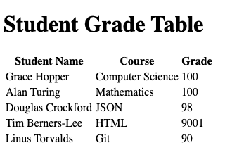

# html-tables

Displaying tabular data in HTML pages.

## Before You Begin

Be sure to check out a new branch from `main` for this exercise. Detailed instructions can be found [**here**](../../guides/Exercise-Workflow_Starting-an-Exercise).

## Quiz

Answer the following questions in the provided markdown file before turning in this exercise:

- What are the six primary HTML elements for creating tables?
- What purpose do the `thead` and `tbody` elements serve?
- Give two examples of data that would lend itself well to being displayed in a table.

## Exercise Overview

In this exercise, you'll delve into the use of HTML tables to organize and display structured data, such as statistical data or schedules, in a clear, grid-like format. You will learn to construct a table using the `<table>` element, filled with rows (`<tr>`), headers (`<th>`), and cells (`<td>`). Additional structure and accessibility features will be introduced through `<thead>`, `<tbody>`, and `<tfoot>` elements, which help separate the table into logical sections and enhance the readability for all users, including those using screen readers. By applying these elements, you will create an organized, accessible, and semantically correct table, adhering to web standards and best practices. This hands-on exercise will bolster your ability to effectively present tabular data on web pages.

## Understanding HTML Tables

An HTML table is a structured set of data arranged in rows and columns, similar to a spreadsheet. Tables are used to display tabular data - data that's logically organized into rows and columns.

#### The Basic Structure of a Table

To start, a basic table requires the `<table>` element, which acts as the container for the table's content. Inside, data is organized using the `<tr>` (table row), `<td>` (table data), and `<th>` (table header) elements. Here's a simple example:

```html
<table>
  <tr>
    <th>Header 1</th>
    <th>Header 2</th>
  </tr>
  <tr>
    <td>Data 1</td>
    <td>Data 2</td>
  </tr>
</table>
```

### Adding Headers with `<th>` Elements

Headers are crucial for indicating the type of data contained in each column or row. The `<th>` element is used for header cells, and browsers typically render these cells in bold and centered text to distinguish them from data cells (`<td>`). Headers improve the readability and accessibility of your table's data.

#### Creating Structured and Accessible Tables

Other table features include the use of `<thead>`, `<tfoot>`, and `<tbody>` elements to further structure the table. These elements group header, footer, and body content, respectively, aiding in readability and accessibility, especially for screen reader users.

- **`<thead>`**: Contains header rows (`<tr>`) that define column titles. It's important for associating data cells with their corresponding headers.
- **`<tbody>`**: Wraps all the content rows (`<tr>`) of your table, excluding the header and footer rows. It can be used multiple times to group rows logically.
- **`<tfoot>`**: Encloses one or more footer rows that summarize or describe the table's data. Placing `<tfoot>` before `<tbody>` in the code ensures screen readers process the footer before the body, improving accessibility.

### Example: An Organized HTML Table

Here's an example that incorporates these elements into a cohesive structure:

```html
<table>
  <thead>
    <tr>
      <th>Header 1</th>
      <th>Header 2</th>
    </tr>
  </thead>
  <tbody>
    <tr>
      <td>Data 1</td>
      <td>Data 2</td>
    </tr>
    <!-- More rows can be added here -->
  </tbody>
  <tfoot>
    <tr>
      <td>Summary 1</td>
      <td>Summary 2</td>
    </tr>
  </tfoot>
</table>
```

### Best Practices for HTML Tables

1. **Use Headers Effectively**: Always include `<th>` elements in your tables to define headers. This improves both the visual presentation and accessibility of your data.
1. **Structure Your Tables**: Utilize `<thead>`, `<tbody>`, and `<tfoot>` to logically organize your table's content. This not only makes your table more readable but also more accessible to users with screen readers.
1. **Keep It Semantic**: Ensure your table serves its intended purpose of displaying tabular data. Avoid using tables for page layout, as it hinders accessibility and responsiveness.

## Exercise

1. Review the example web page screenshot below.
1. Create an `index.html` and add a basic HTML skeleton.
1. Within `index.html`, build the HTML table depicted below.

<p align="center">
  
</p>

## Submitting Your Solution

When your solution is complete, submit a Pull Request on GitHub. Detailed instructions can be found [**here**](../../guides/Exercise-Workflow_Submitting-Your-Solution).

## Additional Reading

1. Read the following sections in [HTML table basics](https://developer.mozilla.org/en-US/docs/Learn/HTML/Tables/Basics) on MDN.
   1. What is a table?
   1. Adding headers with `<th>` elements
1. Read the following sections in [HTML table advanced features and accessibility](https://developer.mozilla.org/en-US/docs/Learn/HTML/Tables/Advanced) on MDN.
   1. Adding structure with `<thead>`, `<tfoot>`, and `<tbody>`
1. Read the MDN documentation on the [`thead` element](https://developer.mozilla.org/en-US/docs/Web/HTML/Element/thead).
1. Read the MDN documentation on the [`tbody` element](https://developer.mozilla.org/en-US/docs/Web/HTML/Element/tbody).
1. Read the MDN documentation on [HTML table basics](https://developer.mozilla.org/en-US/docs/Learn/HTML/Tables/Basics).

## Code Reading Example

```html
<!-- There is an opening tag for a table element -->
<table>
  <!-- There is an opening tag for a thead element -->
  <thead>
    <!-- There is an opening tag for a tr element -->
    <tr>
      <!-- There is an opening tag for a th element -->
      <th>Header 1</th>
      <!-- There is a closing tag for tr element -->
    </tr>
    <!-- There is a closing tag for a thead element -->
  </thead>
  <!-- There is an opening tag for a tbody element -->
  <tbody>
    <tr>
      <td>Data 1</td>
    </tr>
    <!-- There is a closing tag for a tbody element -->
  </tbody>
  <!-- There is an opening tag for a tfoot element -->
  <tfoot>
    <tr>
      <td>Summary 1</td>
      <td>Summary 2</td>
    </tr>
    <!-- There is a closing tag for a tfoot element  -->
  </tfoot>
  <!-- There is a closing tag for a table element -->
</table>
```
